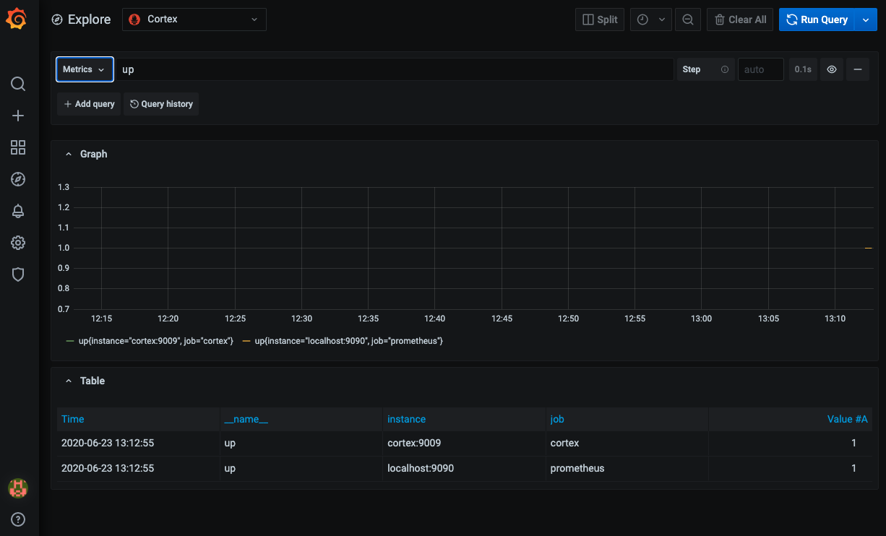

This Docker composition implements [the guide for running Cortex with Cassandra](https://cortexmetrics.io/docs/production/cassandra/) with a single-node Cassandra container and a single-node Cortex container. It also includes Prometheus for some starter data scraping and Grafana for visualization of Cortex.

## Quick start

Start up Cassandra
```shell script
docker-compose up -d cassandra
```

Repeat the following until cassandra service shows "Up (healthy)" in the state column:
```shell script
docker-compose ps
```

Create Cortex keyspace in Cassandra:
```shell script
docker-compose exec cassandra \
  cqlsh -e "CREATE KEYSPACE cortex WITH replication = {'class':'SimpleStrategy', 'replication_factor' : 1};"
```

Start up remainder of services:
```shell script
docker-compose up -d
```

Logs of all services can be followed using:
```shell script
docker-compose logs -f
```

Access Grafana from a browser at <http://localhost:3000/>, where the default login is admin/admin. You can always "change" the new password to be "admin" to keep things simple for local testing.

A [Cortex datasource is pre-create](http://localhost:3000/datasources/edit/1/) and Prometheus is initially configured to scrape itself and Cortex, so you can start by [creating a new dashboard](http://localhost:3000/dashboard/new?orgId=1) or [exploring the data](http://localhost:3000/explore).

For example:


## Tear down

The following will remove the containers and volumes:

```shell script
docker-compose down -v
```